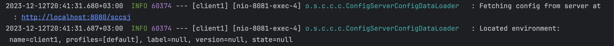

# Spring Cloud Config Server As JDBC

<samp>
    
    
    

</samp>

### Screenshots

# Client
1. Run client application under ``client1`` folder
2. Update any value for
   1. application: `client1`
   2. profile: `dev`
3. Run the actuator refresh api to refresh the context in client app
   1. `curl -H "Content-Type: application/json" -d {} http://localhost:8081/actuator/refresh`
4. Check the logs in client application
5. Verify environment variable is changed

